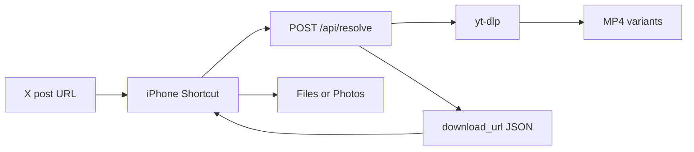

# Architecture

The tool is deliberately small.

## Flow

## Why There Is a Backend

The iPhone shortcut is good at three things:

- receiving a shared URL
- making an HTTP request
- saving a file

It is not a good place to maintain an X parser. X can change the page shape, internal API calls, guest token behavior, or login requirements. `yt-dlp` already tracks those details, so this project wraps it behind a small API.

## Boundaries

The resolver only accepts `x.com` and `twitter.com` status URLs. It returns direct MP4 variants when available and rejects non-X URLs.

By default, it also rejects videos longer than 600 seconds. That keeps the first version focused on short clips and reduces accidental server abuse.

## Deployment Options

- Local Wi-Fi: easiest to test, but the Mac must stay on.
- Private VPN: Tailscale or ZeroTier keeps the service private while allowing remote use.
- VPS: best for daily use. Add `X_VIDEO_APP_TOKEN` and rate limiting.

Avoid publishing an open endpoint. If someone finds it, they can use your server as their video resolver.
